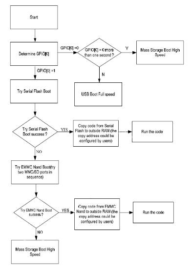
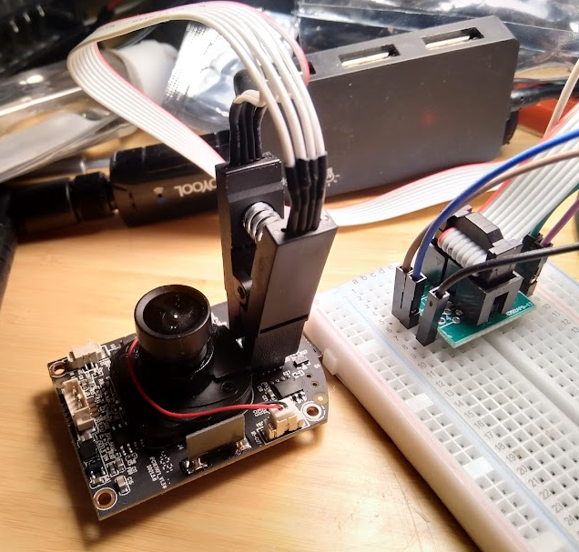
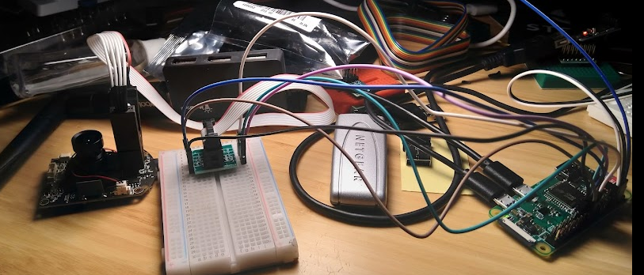

# LSC Smart Rotatable Camera 1080p HD (Action)

Another TUYA powered camera. Yes, I do not mind Tuya, but let's see if we can make this a Tuyain't.


## Checking uART

Available, but the pads are terrible (I ripped off my RX on my board) - some infos available via the log tho:

picocom log here -> ./LSC-SmartRotatableCamera1080pHDpicocom.md

## Get info from uart 

- First of all: there is a login screen. prompt: `anyka login:`. password (in shadow, encrypted) is unknown.

- the CPU is similar to a different Smart camera from LSC

```
CPU: ARM926EJ-S [41069265] revision 5 (ARMv5TEJ), cr=00053177
CPU: VIVT data cache, VIVT instruction cache
Machine: AK3918EV300_JW_F37_V10
ANYKA CPU AK3918 (ID 0x20160100)
```

- checking the linux boot log you see:
```
cp: can't stat '/mnt/volume.*': No such file or directory
dd: can't open '/mnt/_ak39_factory.ini': No such file or directory

anyka login: No TF-Card for F/W Update.
The Version Path "/mnt" Is Not Exist *.bin.
      Current FileName: 
```
- Possibly there is some "update" path we could abuse to get a foot into the system
```
[00:00:00.507|  warn|        ] "/home/hutong/work/platform_ptz/ipcam/ak_tuya_factory_porting.c:166" Condition ( "(((void *)0)) == _Heap" ) Failed.
```
- Maybe this is part of some TUYA SDK? --> Google says no.

- Albeit we know the same ANYKA SoC is used, we know we cannot rely on the `ppsapp` project here, as this camera uses a different system as indicated by: `[00:00:05.055|  info|   APP  ] Command Line "anyka_ipc ". sr(8000), ich(1), och(1), bitrate(16000)` 

- A google search for those "xxx.c" errors just turns up with this page:
https://gathering.tweakers.net/forum/list_messages/2101522`

- Basically they also did the same, but went nowhere with it

## u-boot

trying to put a env.txt onto the sdcard sadly did nothing to modify the boot process - so I assume the required GPIOs are not set (check Anyka 3918 datasheet, https://gzhls.at/blob/ldb/0/b/4/1/700cafec77419c2d7705f376c974b8d0ff72.pdf)


## Next steps

As there is no real way to find anything doable by poking random files with sticks we take the hardcore next step and dump the measly little flash chip on the board. It's easily accessable and can be dumped with a raspberry pi and a test clip from amazon for around 10 bucks.

# Dumping the firmware

## Prelude

Well, that's a new territory for me. I did play around with chips and raspberry pis and the likes, but I never "sucked the brain out of a different chip" so to speak.

## Setup

First, we either need to desolder the chip (yeah... after my attempt to solder a wire to RX/TX on the board that's not going to happen), or we can try to dump the chip in-place on the board.
How to do that? by using one of these friends: https://www.amazon.de/gp/product/B012VSGQ0Q/

Comes with a super-handy breadboard-compatible adaptor so you can fly-wire this.

## Raspberry Pi Zero (W)

OK, so, I'm pretty fed up with all the rpi stuff. Pretty much every time I look something up I need to dig at least an hour to find a.) the proper correct Raspberry Pi version b.) the correct header version and c.) proper images. Very bothersome. I first tried to accidently wire the flash chip up but realized I had the pins shifted by 20, because the image was from a rpi1 and rpi0w does have a bigger extension header, for some reason.

## The dump

The dump itself was fairly easy. Grab yourself a copy of `flashrom`, hook up the wires as described on the flashrom wiki https://www.flashrom.org/RaspberryPi + grab yourself a datasheet of the IC in question you want to dump, in this case: XMC QH64AHIG (https://datasheet.lcsc.com/lcsc/1811072025_XMC-XM25QH32BHIG_C328460.pdf) and throw `flashrom -p linux_spi:dev=/dev/spidev0.0,spispeed=1000` at it. Make sure to make *multiple dumps* as there could be some electronic problems.
Check if at least 2 or 3 of your dumps have the same `md5sum`. You can also play aruond with spispeed, mine was fine with 1k, 2k and 4k speed.

```
➜  DumpCamera md5sum dump*
f79b01d88c9f73d47a30118173726e17  dump-with-1000
f79b01d88c9f73d47a30118173726e17  dump-with-2000
f79b01d88c9f73d47a30118173726e17  dump-with-4000
```



Yes, sometimes even spagethi-wiring can work.




# Analyzing the dump

With a dump in our hands we now can go ahead and check what's on this thing

## Binwalk
```
➜  DumpCamera binwalk dump-with-1000 

DECIMAL       HEXADECIMAL     DESCRIPTION
--------------------------------------------------------------------------------
131060        0x1FFF4         CRC32 polynomial table, little endian
229376        0x38000         uImage header, header size: 64 bytes, header CRC: 0xD5336BCF, created: 2021-09-18 03:35:14, image size: 1422384 bytes, Data Address: 0x81808000, Entry Point: 0x81808040, data CRC: 0x42E6175C, OS: Linux, CPU: ARM, image type: OS Kernel Image, compression type: none, image name: "Linux-3.4.35"
229440        0x38040         Linux kernel ARM boot executable zImage (little-endian)
243643        0x3B7BB         xz compressed data
243864        0x3B898         xz compressed data
1802240       0x1B8000        Squashfs filesystem, little endian, version 4.0, compression:xz, size: 818448 bytes, 335 inodes, blocksize: 131072 bytes, created: 2019-05-19 08:38:38
2850876       0x2B803C        JFFS2 filesystem, little endian
2851276       0x2B81CC        JFFS2 filesystem, little endian
2857892       0x2B9BA4        JFFS2 filesystem, little endian
2905208       0x2C5478        JFFS2 filesystem, little endian
3032184       0x2E4478        JFFS2 filesystem, little endian
3035136       0x2E5000        JFFS2 filesystem, little endian
3067204       0x2ECD44        JFFS2 filesystem, little endian
3134288       0x2FD350        JFFS2 filesystem, little endian
3300216       0x325B78        JFFS2 filesystem, little endian
3305316       0x326F64        JFFS2 filesystem, little endian
3404648       0x33F368        JFFS2 filesystem, little endian
3470456       0x34F478        JFFS2 filesystem, little endian
3537424       0x35FA10        JFFS2 filesystem, little endian
3554004       0x363AD4        JFFS2 filesystem, little endian
3568648       0x367408        JFFS2 filesystem, little endian
3599168       0x36EB40        JFFS2 filesystem, little endian
3637248       0x378000        Squashfs filesystem, little endian, version 4.0, compression:xz, size: 3922466 bytes, 145 inodes, blocksize: 131072 bytes, created: 2021-12-04 03:20:50
```

## Anaylze File System
```
➜  _dump-with-1000.extracted ls -alh squashfs-root*

squashfs-root:
total 4.0K
drwxr-xr-x 1 kuhnchris kuhnchris   78 May 19  2019 .
drwxr-xr-x 1 kuhnchris kuhnchris 5.5K Mar 24 13:41 ..
drwxr-xr-x 1 kuhnchris kuhnchris 1.8K Nov 23  2017 bin
drwxr-xr-x 1 kuhnchris kuhnchris    0 Feb  9  2017 dev
drwxr-xr-x 1 kuhnchris kuhnchris  268 Mar 24 00:41 etc
-rwxr-xr-x 1 kuhnchris kuhnchris 2.8K Nov 22  2017 init
drwxr-xr-x 1 kuhnchris kuhnchris 1.1K May 19  2019 lib
drwxr-xr-x 1 kuhnchris kuhnchris    0 Feb  9  2017 mnt
drwxr-xr-x 1 kuhnchris kuhnchris    0 Feb  9  2017 proc
drwxr-xr-x 1 kuhnchris kuhnchris 1.3K May 19  2019 sbin
drwxr-xr-x 1 kuhnchris kuhnchris    0 Feb  9  2017 sys
drwxr-xr-x 1 kuhnchris kuhnchris    0 Feb  9  2017 tmp
drwxr-xr-x 1 kuhnchris kuhnchris    0 May 19  2019 usr
drwxr-xr-x 1 kuhnchris kuhnchris    6 Apr 14  2017 var

squashfs-root-0:
total 0
drwxrwxr-x 1 kuhnchris kuhnchris   54 Jun 10  2020 .
drwxr-xr-x 1 kuhnchris kuhnchris 5.5K Mar 24 13:41 ..
drwxrwxr-x 1 kuhnchris kuhnchris  266 Sep  9  2021 bin
drwxr-xr-x 1 kuhnchris kuhnchris 1.1K Dec  3 09:03 lib
drwxrwxr-x 1 kuhnchris kuhnchris  310 Dec  3 18:18 local
drwxrwxr-x 1 kuhnchris kuhnchris  376 Oct 28 04:58 modules
drwxrwxr-x 1 kuhnchris kuhnchris  772 Jun 10  2020 sbin
drwxr-xr-x 1 kuhnchris kuhnchris 1.4K Jul  5  2021 share
```

``` 
squashfs-root -> /
squashfs-root-0 -> /usr
```

## Internal infos (devname, ...)

* dev_name = `IPC-XC-C323`
* CPU WIFI Configuration -> Anyka 3916
* JFFS2 -> `/VERSION` -> `2.0.28.501`
* `"Tuya" name: LSC Smart Indoor Camera`
* `"embed_sys_env": "arm-anykav200-linux-uclibc-4.8.5"`
* `"model": "MEARI" ,"category": "sp" ("Smart Camera")`

## Next Steps

From here you have multiple ways of going forward. One idea would be to check the binaries with a tool like `ghidra`. Alternatively you could check for those strings we previously saw in the uart log - and that's what I did.

## Find a non-invasive exploit

Goal now is, to be able to access the camera without going the uart route and not having to reflash the chip with the claw.
Previously we saw there have been mentions of a firmware update procedure.

```
➜  DumpCamera grep "No TF-Card for F/W Update." -r *
_dump-with-1000.extracted/squashfs-root-0/sbin/tf_update.sh:  echo "No TF-Card for F/W Update."
```

Aha! Shell scripts! Who calls this?
```
➜  DumpCamera grep tf_update.sh * -r
_dump-with-1000.extracted/squashfs-root-0/sbin/service.sh:sh /usr/sbin/tf_update.sh
```

That sounds oddly generic.
```
➜  DumpCamera grep service.sh * -r  
_dump-with-1000.extracted/rc.local:/usr/sbin/service.sh start &
_dump-with-1000.extracted/squashfs-root/etc/init.d/rc.local:/usr/sbin/service.sh start &
grep: _dump-with-1000.extracted/squashfs-root-0/bin/daemon: binary file matches
```

It's so generic it seems to be in the Anyka template (that'd be `"squashfs-root"`, the 'customer specific' part is in `/usr`, hence `"squashfs-root-0"`). Also, it's within the `daemon` binary blob, which could forbode some problems... On related note, this sounds like a watchdog, and a quick look at ghidra confirms this - `daemon` checks if `anyka_ipc` is running, and if not, restarts it via `/usr/sbin/anyka_ipc.sh restart`... ok, noted. Also...

```
➜  bin file *
anyka_ipc:      ELF 32-bit LSB executable, ARM, EABI5 version 1 (SYSV), dynamically linked, interpreter /lib/ld-uClibc.so.0, stripped
ccli:           ELF 32-bit LSB executable, ARM, EABI5 version 1 (SYSV), dynamically linked, interpreter /lib/ld-uClibc.so.0, stripped
cmd:            ELF 32-bit LSB executable, ARM, EABI5 version 1 (SYSV), dynamically linked, interpreter /lib/ld-uClibc.so.0, stripped
cmd_serverd:    ELF 32-bit LSB executable, ARM, EABI5 version 1 (SYSV), dynamically linked, interpreter /lib/ld-uClibc.so.0, stripped
daemon:         ELF 32-bit LSB executable, ARM, EABI5 version 1 (SYSV), dynamically linked, interpreter /lib/ld-uClibc.so.0, with debug_info, not stripped
discovery:      ELF 32-bit LSB executable, ARM, EABI5 version 1 (SYSV), dynamically linked, interpreter /lib/ld-uClibc.so.0, stripped
fsck.fat:       ELF 32-bit LSB executable, ARM, EABI5 version 1 (SYSV), dynamically linked, interpreter /lib/ld-uClibc.so.0, stripped
getconf:        ELF 32-bit LSB executable, ARM, EABI5 version 1 (SYSV), dynamically linked, interpreter /lib/ld-uClibc.so.0, stripped
iconv:          ELF 32-bit LSB executable, ARM, EABI5 version 1 (SYSV), dynamically linked, interpreter /lib/ld-uClibc.so.0, stripped
iperf:          ELF 32-bit LSB executable, ARM, EABI5 version 1 (SYSV), dynamically linked, interpreter /lib/ld-uClibc.so.0, stripped
iwconfig:       ELF 32-bit LSB executable, ARM, EABI5 version 1 (SYSV), dynamically linked, interpreter /lib/ld-uClibc.so.0, with debug_info, not stripped
iwlist:         ELF 32-bit LSB executable, ARM, EABI5 version 1 (SYSV), dynamically linked, interpreter /lib/ld-uClibc.so.0, with debug_info, not stripped
iwpriv:         ELF 32-bit LSB executable, ARM, EABI5 version 1 (SYSV), dynamically linked, interpreter /lib/ld-uClibc.so.0, with debug_info, not stripped
ldd:            ELF 32-bit LSB executable, ARM, EABI5 version 1 (SYSV), dynamically linked, interpreter /lib/ld-uClibc.so.0, stripped
mkfs.fat:       ELF 32-bit LSB executable, ARM, EABI5 version 1 (SYSV), dynamically linked, interpreter /lib/ld-uClibc.so.0, stripped
wpa_cli:        ELF 32-bit LSB executable, ARM, EABI5 version 1 (SYSV), dynamically linked, interpreter /lib/ld-uClibc.so.0, with debug_info, not stripped
wpa_passphrase: ELF 32-bit LSB executable, ARM, EABI5 version 1 (SYSV), dynamically linked, interpreter /lib/ld-uClibc.so.0, with debug_info, not stripped
wpa_supplicant: ELF 32-bit LSB executable, ARM, EABI5 version 1 (SYSV), dynamically linked, interpreter /lib/ld-uClibc.so.0, stripped
```
...interesting, the some applications have debug symbols (aside, sadly, from `anyka_ipc`) - noted, tucked away somewhere incase we need it.

Checking that `service.sh` file tho reveals something interesting:

**\<snip\>**
```
if test -d /mnt/usbnet ;then
	FACTORY_TEST=1
	cp -a /mnt/usbnet /tmp
else
	FACTORY_TEST=0
fi

# 检测无线网卡，进入临时 AP 测试模式。
if test -d /mnt/ak_wifi_test_ap ;then
    cp -a /mnt/ak_wifi_test_ap/hostapd /tmp
    cp -a /mnt/ak_wifi_test_ap/hostapd.conf /tmp
    cp -a /mnt/ak_wifi_test_ap/udhcpd.conf /tmp
    cp -a /mnt/ak_wifi_test_ap/setup.sh /tmp
fi


sh /usr/sbin/tf_umount.sh
# AAAAAAAAAAAAAAAA
# 临时先挂载一下 TF 卡先。


# 检测无线网卡，进入临时 AP 测试模式。
if test -f /tmp/setup.sh ;then
    /tmp/setup.sh
    exit
fi
```
**\</snip\>**

Oooh. Let me explain.
- First the sd-card, if detected, will be mounted to /mnt via the script `tf_mount.sh`. This must be a FAT partition.
- After that, there is a check if the folder `usbnet` exists within the root of the partition
- If yes, copy usbnet/* to /tmp. Also set FACTORY_TEST to 1
- **Additionally** it checks for a `ak_wifi_test_ap` folder on the sdcard.
- If it exists it copies a number of hardcoded files (hint hint) to /tmp
- Then it unmounts the sd card
- And checks for a `setup.sh` in the /tmp directory.
- if it is in there, execute it, and exit the service appliation

... noticed something?
There are 2 possible ways to get a `setup.sh` executed, just drop it to /usbnet or /ak_wifi_test_ap. I chose the later as it do not set the FACTORY_TEST flag, and only god knows what that is causing.
This poses us with a 2nd problem tho - now we need scripts, and, possibly some way to connect to the camera.

...

except we do not.
```
➜  DumpCamera find . | grep teln 
./_dump-with-1000.extracted/telnet
./_dump-with-1000.extracted/telnetd
./_dump-with-1000.extracted/squashfs-root/bin/telnet
./_dump-with-1000.extracted/squashfs-root/sbin/telnetd
```
Apparently they ship `telnetd` with the default package (I noticed that far too late, I compiled my own busybox at that point). There were even commented lines in some shell scripts, so this potentially was used by someone during development.

So, in conclusion, we need to write a script that gets executed, and /tmp/setup.sh seems like a very viable option right now.


# Scripting remote access

So, since we know we can do this, here is a little script I fired up, I compiled busybox with a couple of tools, renamed it to "hostapd" and threw that on a sd card.

Here the `setup.sh` 
```
#!/bin/sh
/usr/sbin/blue_led.sh blink 500 500
mkdir -pv /tmp/sd
mount -t vfat /dev/mmcblk0p1 /tmp/sd 2> /dev/null
cd /tmp 2>&1 >>/tmp/sd/out.log
cp -v hostapd busybox 2>&1 >>/tmp/sd/out.log
chmod -v +x busybox 2>&1 >>/tmp/sd/out.log
chmod -v u+s busybox 2>&1 >>/tmp/sd/out.log
ln -v /tmp/busybox sh 2>&1 >>/tmp/sd/out.log
./busybox telnetd 2>&1 >>/tmp/sd/out.log
./busybox telnetd -l /tmp/sh -p 23232 2>&1 >>/tmp/sd/out.log
echo "i ran!" > /tmp/sd/ak_wifi_test_ap/hack_run.success

# --- copying the "rest" of service.sh ---
# FIXME V300 PDK 跑起来需要这个配置文件
cp -av /usr/local/venc.cfg /etc/jffs2 >> /tmp/sd/out.log
cp -v /usr/local/factory_cfg.ini /etc/jffs2/anyka_cfg.ini >> /tmp/sd/out.log
rm -rfv /etc/jffs2/isp*.conf >> /tmp/sd/out.log

# 从 TF 卡中加载涂鸦 UUID
sh /usr/sbin/tf_tuya_uuid.sh >> /tmp/sd/out.log

# 初始化以太网各个驱动。
(sh /usr/sbin/ethernet.sh) & >> /tmp/sd/out.log


/usr/sbin/blue_led.sh blink 50 50
sleep 5
wpa_passphrase "ssid" "pwd" > /tmp/sd/wpa_supplicant.conf
wpa_supplicant -iwlan0 -c/tmp/sd/wpa_supplicant.conf -B -Dwext 2>&1 >> /tmp/sd/out.log
/usr/sbin/blue_led.sh blink 200 200
sleep 5
/usr/sbin/blue_led.sh blink 100 100
udhcpc -i wlan0 
sleep 5
/usr/sbin/blue_led.sh blink 500 500

(echo -e "root\nroot" | /tmp/busybox passwd ) >> /tmp/sd/out.log

echo "ifconfig wlan0?" >> /tmp/sd/out.log
ifconfig wlan0 >> /tmp/sd/out.log


exit 0
```

Just a note, the `blue_led.sh` doesn't work, if you want a visual indicator, use the `system_state_led.sh`.
Also, to save you the ground work - when executing the setup.sh, the service.sh stops execution. Hence I need to do all the wpa_supplicant and passphrase stuff manually. This script opens telnetd on 2 ports, `23` for regular user/pass login prompt (which we don't know), and `23232` for a "login-free experience".
 

Note: during writing this, I noticed the following: Since the start() part never gets executed, we'd also have to add cmd_serverd and the other things. This may also helps to not have to add all the stuff above...

```
	cmd_serverd
	if [ $WIFI_TEST = 1 ]; then
	    #insmod /usr/modules/sdio_wifi.ko
	    insmod /usr/modules/8189fs.ko
	    /mnt/wifitest/wifi_test.sh 
	    echo "start wifi test."
	elif [ $FACTORY_TEST = 1 ]; then
		/usr/sbin/red_led.sh on
		/usr/sbin/anyka_ipc.sh start 
		echo "start product test."

	elif [ $AGING_TEST = 1 ]; then
	    #insmod /usr/modules/sdio_wifi.ko
	    insmod /usr/modules/8189fs.ko
	    sleep 1
	    ifconfig wlan0 up
	    sleep 1
	    /tmp/aging_test 
	    echo "start aging test."
	else
		insmod /usr/modules/ak_motor.ko
		daemon
		/usr/sbin/red_led.sh on
		/usr/sbin/anyka_ipc.sh start 
		echo "start net service......"
```

## SD-Card structure

```
➜  579B-A027 tree .
.
├── ak_wifi_test_ap
│   ├── hack_run.success    (-> gets generated by setup.sh)
│   ├── hostapd             (-> busybox)
│   └── setup.sh            (-> entry point)
├── out.log                 (-> gets generated by setup.sh)
└── wpa_supplicant.conf     (-> gets generated by setup.sh)

```

# After the login

Now, that we have access, we actually are able to access the system.

BUT.

anyka_ipc is not running? Weird.

Starting the `anyka_ipc.sh` service actually crashes with a "out of memory" issue. The device itself has 32M memory, of that 32M, about 4-5M are used by the OS - and with 1 or 2 additional processes (telnetd, sh) this causes the system to kill anyka_ipc - even after adapting the oom_kill_score, it's within the `anyka_ipc` app.

**BUT**
## Result
During these `anyka_ipc` crashes I noticed the app actually output something very interesting:
```
[net_get:89] ioctl: SIOCGIFADDR, Cannot assign requested address, iface: eth0
***********************************************
*                  RTSP LINK                  *
***********************************************
* MAIN CHANNEL : rtsp://xxx.yyy.zzz.aaa/main_ch
* SUB CHANNEL  : rtsp://xxx.yyy.zzz.aaa/sub_ch
***********************************************
[rtsp_set_media_type:1055] * channel 0 media-type:0
```

Well, I did know that port 5000 was open, but OVFIP wasn't working on port 8000 (maybe in Ghidra we can figure out why) - but with those links (actually just the main_ch, the sub_ch isn't working) we get real-time local RTSP stream. :-)

Since this was my main concern and reason to actually "hack" the cam, I don't actually need to do anymore. The cam itself can be locked in it's own private network so I won't have to worry about the TUYA stuff - but I keep this here, so people actually can take care of these things if they want to.


## Theoretical update flow

Anaylzing the update scripts I theorized how a Update needs to be constructed.

```
➜  sbin cat ../share/BUNDLE 
HT_IPC167TF_TUYA_AK3918EV300
➜  sbin cat ../share/VERSION 
2.0.28.501
```

The version needs to be higher than "that" VERSION.

Update flow: 
```
(sdcard)/*.bin files
stat -c %s xxx.bin
dd if=$TF_TAR_CUR of=$INFO_FILE bs=1 skip=$FW_RAW_SIZE 2>>/dev/null
cat $INFO_FILE
```

So there are now key-value (with = separated) files attached to `tar` files. OK.

INFO_FILE content:
```
bundle=xxx
version=xxx
author=xxx
md5=xxx
```

```
if BUNDLE == infofile_bundle
  update_TMP.sh script
```

Okay, so you'd need to `md5sum` the tar file, add the BUNDLE string (the HT_IPC167TF one) and a version higher than the current one to create an update file. Concatenate the `tar` file with the "update" text file, pad it with the block size (`stat -c`) and off you go.


## Weird things

As memory was a big concern here, I tried to add a swap image on the SD card but... swap has been disabled in the kernel.

```
/tmp:# dd if=/dev/zero of=/tmp/sd/swap.img bs=1M count=32
/tmp:# ./busybox mkswap /tmp/sd/swap.img
/tmp:# ./busybox swapon /tmp/sd/swap.img
swapon: /tmp/sd/swap.img: swapon failed: Function not implemented                 
```

--> https://www.acmesystems.it/ts_swapon_failed

## Update!

Here's a version *without any external dependencies* **and** working `anyka_ipc`!

Put the following file into the directory "ak_wifi_test_ap" as "setup.sh":
```
#!/bin/sh
mkdir -pv /tmp/sd
mount -t vfat /dev/mmcblk0p1 /tmp/sd 2> /dev/null
/sbin/telnetd -l /tmp/sh -p 23232 2>&1 >>/tmp/sd/out.log
# --- copying the "rest" of service.sh ---
cp -av /usr/local/venc.cfg /etc/jffs2 >> /tmp/sd/out.log
cp -v /usr/local/factory_cfg.ini /etc/jffs2/anyka_cfg.ini >> /tmp/sd/out.log
rm -rfv /etc/jffs2/isp*.conf >> /tmp/sd/out.log
sh /usr/sbin/tf_tuya_uuid.sh >> /tmp/sd/out.log
sh /usr/sbin/ethernet.sh >> /tmp/sd/out.log

cmd_serverd
insmod /usr/modules/ak_motor.ko
daemon
/usr/sbin/red_led.sh on
/usr/sbin/anyka_ipc.sh start 
```

Insert SD, boot cam, access port 23232, got root. You're welcome.

Like what you read? Support me on Ko-Fi - https://ko-fi.com/kuhnchris